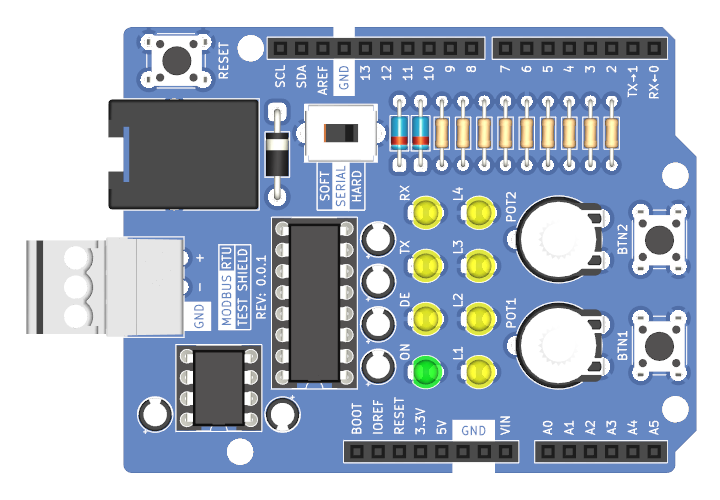

# ModbusRTU Test Shield

A shield for Arduino boards that provides an RS-485 transceiver, RS-232 transceiver, and a selection of buttons, lights, and knobs.

- This shield is designed to work with both 5V and 3.3V Arduino boards.
- A 3-position removable screw terminal is used as the RS-485 interface.
- A RJ12 connector is used as the RS-232 inteface. The pinout of this connector is designed to make it compatible with Automation Direct products.
- The potentiomter knobs can be easily removed so you can stack other shields on top of this one.
- There is a switch to switch the `RX` pin beetween D0 and D10 and the `TX` pin betweeen D1 and D11 respectively.
  This is intended to allow you to easily switch between using a `HardwareSerial` port or a `SoftwareSerial` port.

> [!NOTE]
> This design is distributed WITHOUT ANY EXPRESS OR IMPLIED WARRANTY, INCLUDING OF MERCHANTABILITY, SATISFACTORY QUALITY AND FITNESS FOR A PARTICULAR PURPOSE.
> 
> The `RX` signals from the RS-485 and RS-232 transceivers are boolean `AND`ed together.
> This allows the `RX` pin of the Arduino board to receive from both transceivers, but if devices are connected to both interfaces, they could interfere with each other.
>
> The `TX` signal is connected to both the RS-485 and RS-232 transceivers.
> Transmitting will send both RS-485 and RS-232 signals on their respecive interfaces.

### Documentation
- [Schematic](ModbusRTU-Test-Shield.pdf)
- [KiCAD Source Files](src)
- [STEP 3D Model](extras/ModbusRTU-Test-Shield.step)

## Fabrication

### Circuit Board
#### Specifications
- Board Length: __68.58mm__
- Board Width: __53.34mm__
- Board Thickness: __1.6mm__
- Substrate Material: __FR4__
- Copper Layers: __2__
- Copper Thickness: __1oz__
- Soldermask Color: __Any__ (Blue Suggested)
- Smallest Hole Diameter: __0.6mm__
- Smallest Trace Width: __0.2mm__ (7.8mil)
- Smallest Trace Spacing: __0.2mm__ (7.8mil)

#### Suppliers
Below are some circuit board manufacturers I have used in the past.
Generally you will need to upload the upload the [gerber and drill files](gerbers) to their websites in a .zip folder.

- [OSH Park](https://oshpark.com) is a US based circuit board fabrication service.
  They tend to be more expensive than other manufacturers and the number of options they give you are limited (If you use this manufacturer, I hope you like purple).

- [Seeed Studio Fusion](https://www.seeedstudio.com/fusion_pcb.html) makes circuit boards in China.
  They have a lot of options when ordering; please refer to the [specifications](#specifications) above when making your choices.
  They do have a circuit board assembly service as well, but I am not especially familiar with it.

### Purchase Components
#### Bill of Materials

| Reference    | Qty | Manufacturer           | Part Number           | Description                         | Notes                                                                                         |
|--------------|----:|------------------------|-----------------------|-------------------------------------|-----------------------------------------------------------------------------------------------|
| C1-C6        |   6 | KEMET                  | ESS105M050AB2EA       | 1uF Aluminum Electrolytic Capacitor |                                                                                               |
| D1-D4, D6-D8 |   7 | Würth Elektronik       | 151031YS06000         | Yellow LED                          | This is used for various indicators.                                                          |
| D5           |   1 | Würth Elektronik       | 151031VS04000         | Green LED                           | This is used to indicate that 5V is present.                                                  |
| D9, D10      |   2 | Vishay                 | BAT43-TAP             | Schottky Diode                      | This diode is used to `AND` and level convert the `RX` signals from the transceivers.         |
| D11          |   1 | Vishay                 | SB260S-E3/54          | Schottky Diode                      | This diode allows the Arduino board to be powered through the RS-232 interface.               |
| J1-J4        |   1 | SparkFun Electronics   | PRT-11417	            | Stacking Socket Header Kit          | This kit contains multiple parts.                                                             |
| J5           |   1 | Phoenix Contact        | 5434557               | 3-Position Terminal Block Plug      | This screw terminal works with a special pin header and is not soldered to the circuit board. |
| J6           |   1 | Amphenol ICC (FCI)     | 54601-906WPLF         | RJ12 Connector                      |                                                                                               |
| R1-R8        |   8 | Stackpole Electronics  | CFM14JT330R           | 330 Ohm Resistor                    | This is a generic 330 Ohm resistor; a smilarly sized component of the same value should work. |
| R9           |   1 | Stackpole Electronics  | CFM14JT10K0           | 10K Ohm Resistor                    | This is a generic 10K Ohm resistor; a smilarly sized component of the same value should work. |
| RV1, RV2     |   2 | Piher/Amphenol         | PT10MV10-103A2020-E-S | 10K Ohm Potentiometer               |                                                                                               |
| RV1, RV2     |   2 | Piher/Amphenol         | JPEPL6052INI          | Potentiometer Knob                  |                                                                                               |
| SW1-SW3      |   3 | TE Connectivity        | 1825910-6             | 6mm Pushbutton Switch               | This is a generic 6mm pushbutton switch. Feel free to substitute.                             |
| SW4          |   1 | C&K                    | OS202011MS2QN1        | DPDT Slide Switch                   |                                                                                               |
| U1           |   1 | Analog Devices         | LT1785ACN8#PBF        | RS-485 Half-Duplex Transceiver      | This part is used with a socket; DO NOT solder this part to the circuit board.                |
| U2           |   1 | Texas Instruments      | MAX232N               | RS-232 Transceiver                  | This part is used with a socket; DO NOT solder this part to the circuit board.                |
| XJ5          |   1 | Phoenix Contact        | 5430438               | 3-Position Terminal Block Header    | This is the socket for the RS-485 screw terminal and is soldered to the circuit board.        |
| XU1          |   1 | Assmann WSW Components | AR 08-HZL/01-TT       | 8-Position DIP Socket               | This is the socket for the RS-485 transceiver and is soldered to the circuit board.           |
| XU2          |   1 | Assmann WSW Components | AR 16-HZL/01-TT       | 16-Position DIP Socket              | This is the socket for the RS-232 transceiver and is soldered to the circuit board.           |

#### Suppliers
Below are some electronics suppliers I have used in the past:

- [Digi-Key](https://www.digikey.com/) is my usual go-to supplier for electronic components.
  Their website makes it pretty easy to sort through parts.

- [Mouser](https://www.mouser.com/) is very similar to Digi-Key in a lot of ways.
  They sometimes have better pricing, and they have excellent customer support.

- [Newark](https://www.newark.com/) tends to have a bit different selection than Digi-Key and Mouser, especially in the area of connectors.

- [Octopart](https://octopart.com/) is not a supplier per se; it is essenitally an electronic component search engine.
  This can be a very helpful tool when looking for parts, especially somewhat unusual ones, like extended socket headers.

All of these suppliers have a feature on their respective websites where you can upload a spreadsheet file, such as [ModbusRTU-Test-Shield-BOM.csv](ModbusRTU-Test-Shield-BOM.csv), to populate the cart or find parts.

## Assembly
### Tools and Supplies
If you are assembling the ModbusRTU Test Shield yourself, you will need the following tools and supplies:

| Item              | Optional | Notes                                                                                                                                              |
|-------------------|----------|----------------------------------------------------------------------------------------------------------------------------------------------------|
| Soldering Iron    | No       | Make sure you use a good quality soldering iron. A poor quality soldering iron will give you a miserable soldering experience.                     |
| Flush Cutters     | No       | These are used to trim component leads.                                                                                                            |
| Flux Core Solder  | No       | Leaded solder is easier to work with, but lead-free solder is better for the environment.                                                          |
| Solder Flux       | Yes      | Extra flux will make the solder flow better. I don't usually use it when through-hole soldering, but it can be helpful.                            |
| Solder Wick       | Yes      | This is used to remove solder from places you don't want it.                                                                                       |
| Solder Sucker     | Yes      | If you need to de-solder a component, this, along with solder wick, is the tool you want. This can quickly remove most of the solder from a joint. |
| Isopropyl Alcohol | Maybe    | This is used to remove flux. It is not needed if you are using no-clean flux.                                                                      |
| Dish Soap         | Maybe    | This is used to remove flux residue. It is not needed if you are using no-clean flux.                                                              |

> **Note on Flux:**  
> Traditional flux if left on the assembled circuit board could cause some serious issues.
> It can potentially cause shorts or significant [parasitic capacitance](https://en.wikipedia.org/wiki/Parasitic_capacitance).
> It is also somewhat corrosive and can, over time, damage your circuit board.
> This sort of flux must be cleaned off the board after assembly.
> 
> To address these issues there are no-clean fluxes, that can be left on the circuit board assembly and are unlikly to cause these issues.
> There are also water-soluble fluxes that can be cleaned off with hot water, though I have found that some isopropyl alcohol can speed up the process.
> There are also fluxes that are both no-clean and water soluble; this is what I like to use.

